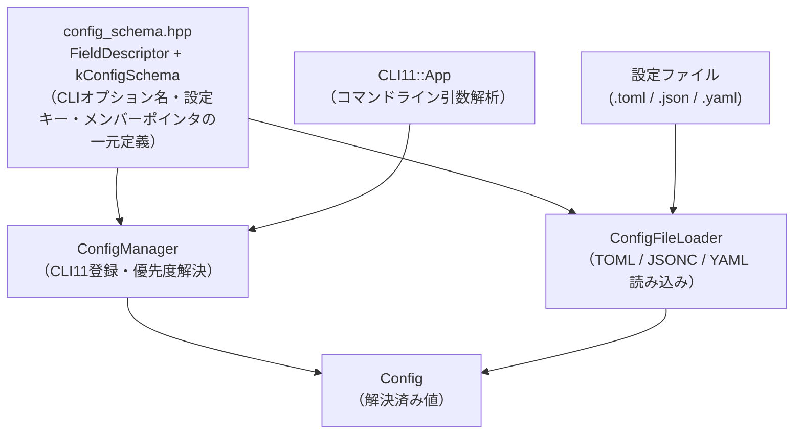
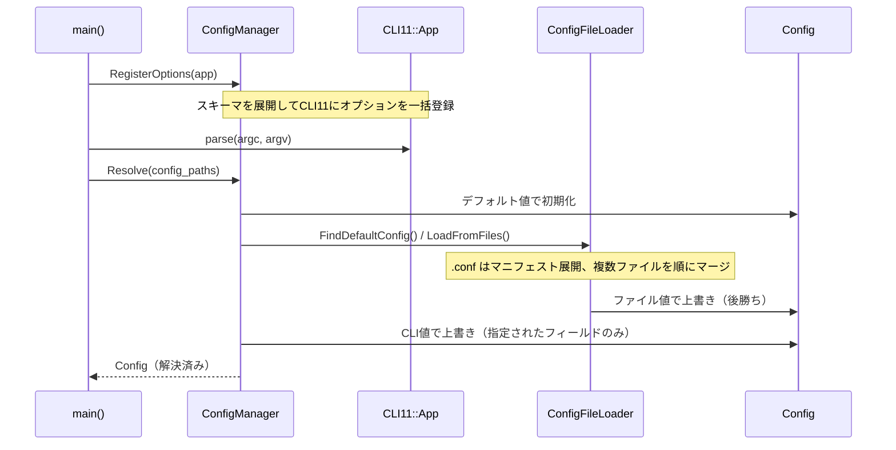
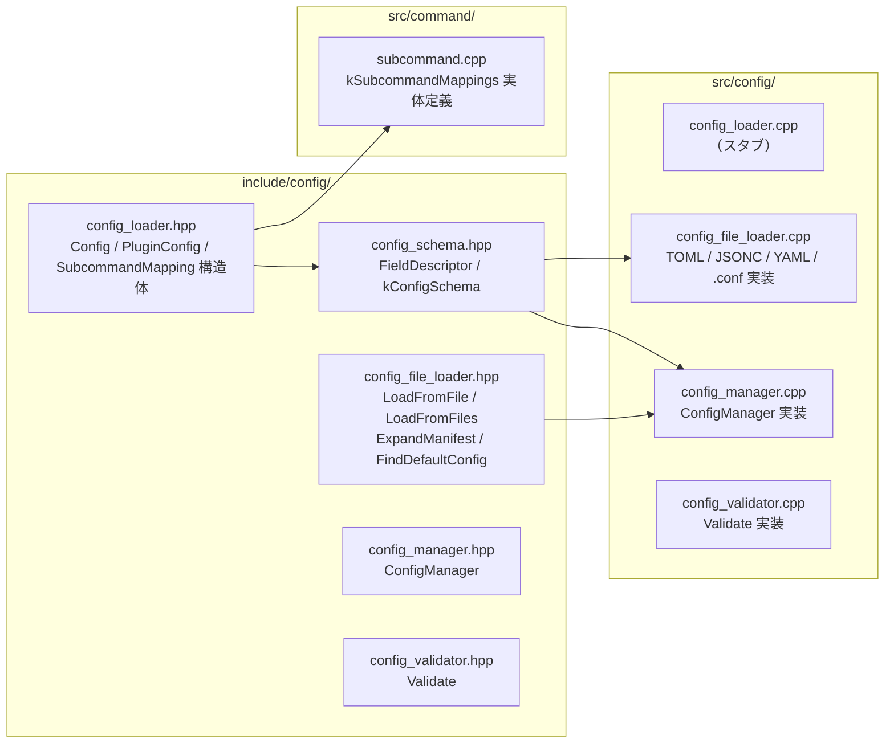
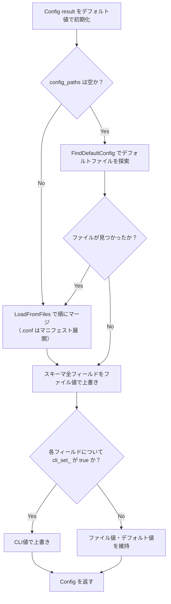

# 設定システム設計ドキュメント

利用ガイドは [config-system-guide.md](config-system-guide.md) を参照。

---

## 概要

このプロジェクトの設定システムは、**CLI引数**と**設定ファイル（TOML / JSONC / YAML）**を統合管理する。

設計上の最重要目標は「**オプションを1つ追加するときの変更箇所を2ファイル・最小行数に抑える**」ことである。
これにより、機能追加時の記述漏れや、CLI・設定ファイル間での動作の不一致を防ぐ。

### 対応する設定ファイル形式

| 拡張子           | 形式  | ライブラリ            | 備考              |
| ---------------- | ----- | --------------------- | ----------------- |
| `.toml`          | TOML       | tomlplusplus v3.4.0   |                                    |
| `.json`          | JSONC      | nlohmann/json v3.12.0 | `//` コメント対応                  |
| `.yaml` / `.yml` | YAML       | fkYAML v0.4.2         |                                    |
| `.conf`          | マニフェスト | —                     | 1行1パス、`#` コメント対応        |

### 優先度

```text
CLI引数 > 後方の設定ファイル > 前方の設定ファイル > Config構造体のデフォルト値
```

`--config` は複数回指定可能。`.conf` 拡張子のファイルはマニフェスト（ファイルリスト）として展開される。

---

## 概要設計

### コンポーネント構成



### 起動時の処理フロー



### 設定ファイルの自動探索

`-c / --config` を指定しない場合、以下のパスを順に探索する。

- `config/default.toml`
- `config/default.json`
- `config/default.yaml`

複数のファイルが同時に存在する場合はエラーとなる。

```text
Error: Multiple default config files found: config/default.toml config/default.json
```

`--config` を明示指定した場合は自動探索をスキップし、他形式のデフォルトファイルが存在しても無視する。

### CLIオプション名の規則

設定ファイルのネスト構造をドット区切りで表現する。

```sh
# ファイルの settings.value キーに対応するCLIオプション
./build/cmd_cli11 --settings.value=42
```

---

## C++ 詳細設計

### ファイル構成とAPI

#### ファイル依存関係



#### 各ファイルの役割とAPI

##### `include/config/config_loader.hpp`

**役割:** 設定値を保持するデータ構造の定義。他のヘッダが依存する基盤。

| 型 | 説明 |
| --- | --- |
| `PluginConfig` | プラグイン1件の設定 (`file: string`, `number: uint64_t`) |
| `SubcommandConfig` | サブコマンドのオペランド (`a: int`, `b: int`) |
| `Config` | アプリ全体の設定値を保持するルート構造体 |
| `SubcommandMapping` | サブコマンド名と `Config` メンバーポインタのペア |
| `kSubcommandMappings[]` | `SubcommandMapping` の配列（`subcommand.cpp` で実体定義） |
| `kSubcommandMappingCount` | 上記配列の要素数 |

`Config` のフィールド:

| フィールド | 型 | デフォルト値 |
| --- | --- | --- |
| `title` | `std::string` | `"title"` |
| `value` | `std::uint64_t` | `10` |
| `plugins` | `std::vector<PluginConfig>` | `{}` |
| `add` / `subtract` / `multiply` / `divide` | `SubcommandConfig` | `{0, 0}` |

---

##### `include/config/config_schema.hpp`

**役割:** スキーマ定義の一元管理。CLIオプション名・設定ファイルキー・`Config` メンバーポインタを紐づける。新オプション追加時にここだけ変更すれば CLI 登録・ファイル読み込みの両方が自動で対応される。

| シンボル | 種別 | 説明 |
| --- | --- | --- |
| `FieldDescriptor<Owner, T>` | テンプレート構造体 | 1フィールド分の記述子。`cli_option` / `config_key` / `description` / `member` を保持 |
| `FieldDescriptor(...)` (CTAD補助) | 推論ガイド | C++17 CTAD により型引数省略を可能にする |
| `kConfigSchema` | `constexpr` タプル | 全スキーマフィールドを `std::tuple<FieldDescriptor...>` で列挙 |

---

##### `src/config/config_file_loader.hpp` / `config_file_loader.cpp`

**役割:** 設定ファイルの読み込み実装。拡張子でフォーマットを自動判別し、`Config` に書き込む。

公開API（`namespace config`）:

| 関数 | シグネチャ | 説明 |
| --- | --- | --- |
| `LoadFromFile` | `(const string& path, Config& conf) -> void` | 1ファイルを読み込んで `conf` に書き込む。拡張子 `.toml` / `.json` / `.yaml` / `.yml` に対応 |
| `LoadFromFiles` | `(const vector<string>& paths, Config& conf) -> void` | 複数ファイルを順に読み込んで後勝ちマージ。`.conf` はマニフェストとして展開 |
| `ExpandManifest` | `(const string& manifest_path) -> vector<string>` | `.conf` マニフェストを読み込み、相対パスをマニフェスト親ディレクトリ基準で解決して返す |
| `FindDefaultConfig` | `() -> string` | `config/default.{toml,json,yaml}` を探索。複数存在する場合は例外 |

内部実装（匿名 namespace）:

| シンボル | 種別 | 説明 |
| --- | --- | --- |
| `ResolveDottedKey<Accessor, T, Node>` | テンプレート関数 | `"settings.value"` のようなドット区切りキーでネストを辿り `optional<T>` を返す |
| `TomlAccessor` | 構造体 | `toml::table` 用の `GetChild` / `GetLeaf` |
| `JsonAccessor` | 構造体 | `nlohmann::json` 用の `GetChild` / `GetLeaf` |
| `YamlAccessor` | 構造体 | `fkyaml::node` 用の `GetChild` / `GetLeaf` |
| `LoadFromToml` | 関数 | TOML ファイルを読み込んで `Config` に書き込む |
| `LoadFromJson` | 関数 | JSON / JSONC ファイルを読み込んで `Config` に書き込む |
| `LoadFromYaml` | 関数 | YAML ファイルを読み込んで `Config` に書き込む |

---

##### `include/config/config_manager.hpp` / `src/config/config_manager.cpp`

**役割:** CLI11 へのオプション登録と、CLI引数・設定ファイル・デフォルト値の優先度解決を担うクラス。

`ConfigManager` クラス（`namespace config`）:

| メンバー | 種別 | 説明 |
| --- | --- | --- |
| `ConfigManager()` | コンストラクタ | `cli_values_` / `file_values_` をデフォルト初期化。`cli_set_` をスキーマサイズ分 `false` で初期化 |
| `RegisterOptions(CLI::App& app)` | メソッド | `kConfigSchema` を展開して CLI11 にオプションを一括登録。各オプションに `each` コールバックを設定し、明示指定されたフィールドを `cli_set_` に記録 |
| `Resolve(const vector<string>& config_paths)` | メソッド | 設定ファイルを読み込み、CLI引数 > 後方ファイル > 前方ファイル > デフォルトの優先度でスキーマフィールドを解決して返す。`config_paths` が空の場合は `FindDefaultConfig()` で自動探索 |
| `GetFileValues()` | メソッド | `Resolve()` 後に有効な、ファイルから読み込んだ生の `Config` を返す。`plugins` などスキーマ外フィールドの取得に使用 |
| `cli_values_` | `Config` | CLI11 のパース結果書き込み先 |
| `file_values_` | `Config` | 設定ファイルから読み込んだ値 |
| `cli_set_` | `vector<bool>` | スキーマの各フィールドが CLI で明示指定されたかを記録するフラグ配列 |

---

##### `include/config/config_validator.hpp` / `src/config/config_validator.cpp`

**役割:** マージ後の `Config` を検証する。

| 関数 | シグネチャ | 説明 |
| --- | --- | --- |
| `Validate` | `(const Config& config) -> string` | 正常時は空文字列、異常時はエラーメッセージを返す。検証項目: `title` が空でない、`divide.b == 0 && divide.a != 0` でない |

---

##### `src/command/subcommand.cpp`

**役割:** `kSubcommandMappings` 配列の実体定義（`config_loader.hpp` で `extern` 宣言）。

| シンボル | 説明 |
| --- | --- |
| `kSubcommandMappings[]` | サブコマンド名（`"add"`, `"subtract"` 等）と `Config` メンバーポインタのペア配列 |
| `kSubcommandMappingCount` | 配列の要素数 |

### FieldDescriptor テンプレート

`Config` 構造体の1フィールドと、CLIオプション名・設定ファイルキーを紐づける記述子。

```cpp
// include/config/config_schema.hpp

template <typename Owner, typename T>
struct FieldDescriptor {
    std::string_view cli_option;  // "--settings.value"
    std::string_view config_key;  // "settings.value"（ドット区切りでネスト表現）
    std::string_view description; // CLIヘルプ文字列
    T Owner::*member;             // &Config::value（ポインタ・トゥ・メンバー）
};

// C++17 CTAD補助：型引数を省略して記述できるようにする
template <typename Owner, typename T>
FieldDescriptor(std::string_view, std::string_view, std::string_view, T Owner::*)
    -> FieldDescriptor<Owner, T>;
```

**ポインタ・トゥ・メンバー**（`T Owner::*member`）を使うことで、
型安全にフィールドへアクセスできる。アクセス時は `conf.*field.member` と記述する。

### kConfigSchema の定義

全オプションを `std::tuple` に格納する。
`std::tuple` を使うことで、各フィールドの型を静的に保持でき、
後述の `std::apply` によりコンパイル時に展開される。

```cpp
// include/config/config_schema.hpp

inline constexpr auto kConfigSchema = std::make_tuple(
    FieldDescriptor{"--title",          "title",          "Application title", &Config::title},
    FieldDescriptor{"--settings.value", "settings.value", "Numeric value",     &Config::value}
);
```

### ConfigManager クラス

```cpp
// include/config/config_manager.hpp

class ConfigManager {
public:
    void RegisterOptions(CLI::App& app);
    Config Resolve(const std::vector<std::string>& config_paths); // スキーマフィールドのみ解決
    const Config& GetFileValues() const;                          // ファイルの生値（スキーマ外フィールド取得用）
private:
    Config cli_values_;         // CLI11のパース結果書き込み先
    Config file_values_;        // 設定ファイルから読み込んだ値（Resolve() 後に有効）
    std::vector<bool> cli_set_; // 各フィールドがCLIで明示指定されたか
};
```

`Resolve()` はスキーマ定義フィールド（`kConfigSchema` に列挙されたもの）のみを解決して返す。
`config_paths` が空の場合はデフォルト探索を行い、`.conf` ファイルはマニフェストとして展開する。
`plugins` や `SubcommandConfig` などスキーマ外の複合型フィールドは `GetFileValues()` で取得し、
呼び出し元（`cli.cpp`）の `MergeNonSchemaFields()` でマージする。

`cli_values_` はスキーマサイズ分のフィールドを持つ `Config`。
`cli_set_` はどのフィールドが実際にCLIで指定されたかを記録するフラグ配列。
この2つを分離することで「CLIで未指定のフィールドはファイル値を使う」という優先度を実現する。

---

## 実装の工夫

### std::apply によるコンパイル時タプル展開

`kConfigSchema` のループ処理には `std::apply`（C++17）を使う。
これにより、タプルの各要素に対してテンプレートクロージャを展開でき、
**型情報を失わずに**全フィールドを一括処理できる。

#### CLI11 への一括登録（RegisterOptions）

```cpp
std::apply(
    [&](auto &&...field) {
        ([&] {
            auto *opt = app.add_option(
                std::string(field.cli_option),
                cli_values_.*field.member,  // パース結果の書き込み先
                std::string(field.description)
            );
            const std::size_t i = idx++;
            // パース後コールバックでCLI指定フラグを立てる
            opt->each([this, i](const std::string &) { cli_set_[i] = true; });
        }(), ...);  // 即時呼び出し展開（fold expression）
    },
    kConfigSchema
);
```

`opt->each(callback)` はそのオプションが実際にパースされたときに呼ばれる。
これにより「ユーザーが明示的に指定したか」を `cli_set_[i]` に記録できる。
デフォルト値と `0` や空文字列が区別できない場合でも正確に判定できる。

#### 設定ファイル読み込みへの適用

`std::remove_reference_t<decltype(conf.*field.member)>` でメンバーの型を取得し、
各パーサーの型付きAPIに渡す。これにより型変換コードを書かなくてよい。

```cpp
std::apply(
    [&](auto &&...field) {
        ([&] {
            // メンバー型をコンパイル時に取得
            using FieldType = std::remove_reference_t<decltype(conf.*field.member)>;
            auto val = ResolveTomlKey<FieldType>(tbl, field.config_key);
            if (val.has_value()) {
                conf.*field.member = *val;  // ファイルに存在するキーのみ上書き
            }
        }(), ...);
    },
    kConfigSchema
);
```

#### 設定表示（ShowConfig）への適用

スキーマを参照するため、新しいフィールドを追加すると表示も自動的に増える。
この関数はユーザコードの `cli.cpp` に定義する（`config_manager` の責務外）。

```cpp
std::apply(
    [&](auto &&...field) {
        ([&] { fmt::print("{}: {}\n", field.config_key, conf.*field.member); }(), ...);
    },
    config::kConfigSchema
);
```

### ドット区切りキーの解決

設定ファイルのネストを `"settings.value"` のようなドット区切り文字列で表現し、
共通テンプレート `ResolveDottedKey<Accessor, T>` でノードを辿る。

各フォーマットは `GetChild`（子ノード取得）と `GetLeaf`（葉の値取得）の
2メソッドを持つアクセサ構造体で差異を吸収する。

```cpp
// 共通テンプレート
template <typename Accessor, typename T, typename Node>
std::optional<T> ResolveDottedKey(const Node &root, std::string_view dotted_key) {
    const Node *current = &root;
    std::string_view remaining = dotted_key;
    while (true) {
        const auto dot_pos = remaining.find('.');
        if (dot_pos == std::string_view::npos) {
            return Accessor::template GetLeaf<T>(*current, std::string(remaining));
        }
        const auto head = std::string(remaining.substr(0, dot_pos));
        remaining = remaining.substr(dot_pos + 1);
        current = Accessor::GetChild(*current, head);
        if (current == nullptr) { return std::nullopt; }
    }
}

// TOML アクセサの例（JSON・YAML も同様のパターン）
struct TomlAccessor {
    static const toml::table *GetChild(const toml::table &node, const std::string &key) {
        return node[key].as_table();
    }
    template <typename T>
    static std::optional<T> GetLeaf(const toml::table &node, const std::string &key) {
        return node[key].template value<T>();
    }
};
```

戻り値に `std::optional<T>` を使うことで「キーが存在しない」と「値が0や空文字列」を区別し、
**ファイルに存在するキーのみ上書き**するという仕様を安全に実装できる。

### 優先度解決（Resolve の実装）



### plugins フィールドの扱い

`std::vector<PluginConfig>` のような複合型はスキーマ管理の対象外とし、
`config_file_loader.cpp` 内で個別に実装する。
CLIからの指定は対応せず、設定ファイル専用フィールドとして扱う。

```toml
# TOML での記述例
[[plugin]]
file = "a.so"
number = 1

[[plugin]]
file = "b.so"
number = 2
```

### サブコマンド別設定フィールドの扱い

`SubcommandConfig` のような複合型はスキーマ管理の対象外。
サブコマンド名と `Config` メンバーのマッピングは `SubcommandMapping` 構造体と
`kSubcommandMappings` 配列で管理し、`src/command/subcommand.cpp` で実体を定義する。
サブコマンドを追加・変更する際は `subcommand.cpp` のみ修正すればよい。

優先度解決の仕組み:

1. CLI11 がサブコマンド引数を `Config` の `add.a`, `add.b` 等に直接書き込む
2. `ConfigManager::Resolve()` が設定ファイルを読み込み、`GetFileValues()` でアクセス可能にする
3. `cli.cpp` が `kSubcommandMappings` をループし、CLI 未指定のサブコマンドにファイル値を適用する

```cpp
// cli.cpp でのマージ例
const Config &file_vals = config_manager.GetFileValues();
for (std::size_t i = 0; i < kSubcommandMappingCount; ++i) {
    const auto &m = kSubcommandMappings[i];
    if (!app.got_subcommand(m.key)) {
        config.*m.member = file_vals.*m.member;
    }
}
```

```toml
# TOML での記述例
[subcommands.add]
a = 10
b = 5
```
